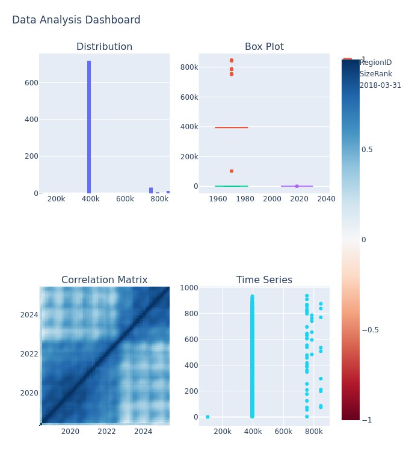
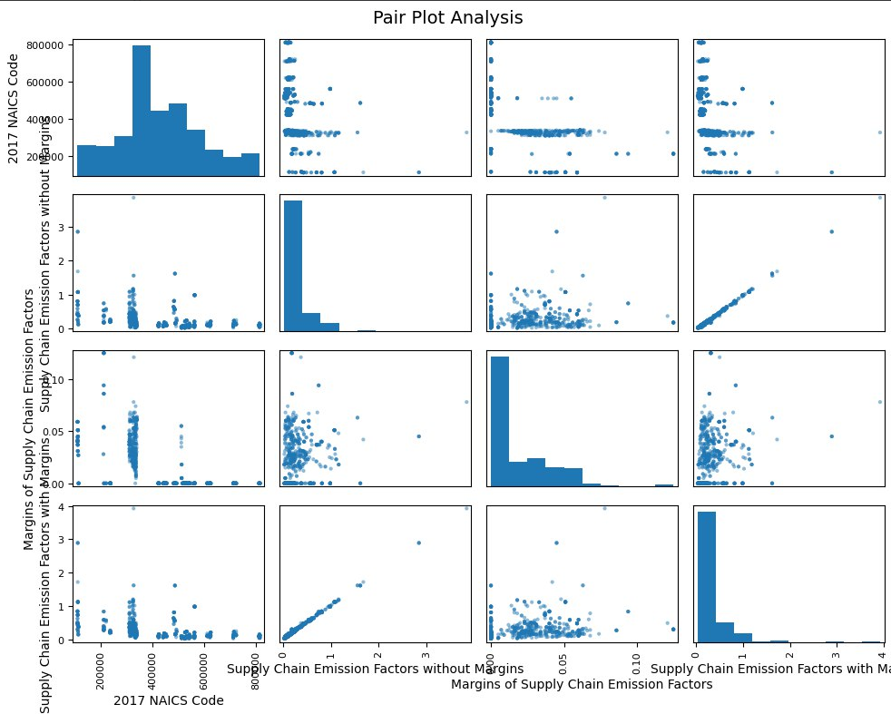

<!--
Bilingual README: Hebrew (RTL) and English
Repository: https://github.com/Artisa111/databot-analytics
-->

<p align="center">
  
  
  <a href="https://github.com/Artisa111/databot-analytics/stargazers" target="_blank"></a>
  
</p>

<p align="center">
  <a href="https://databot-analytics-1.streamlit.app" target="_blank">
    
  </a>
  <a href="https://t.me/maydatabot123_bot" target="_blank">
    
  </a>
  <a href="https://railway.app/new/template?template=https%3A%2F%2Fgithub.com%2FArtisa111%2Fdatabot-analytics" target="_blank">
    
  </a>
</p>

<p align="center">
  <a href="#hebrew">🇮🇱 עברית</a> • <a href="#english">🇺🇸 English</a>
</p>

---

<div id="hebrew" dir="rtl" lang="he">

<h1 align="right">🧠📊 דאטאבוט אנליטיקס</h1>
<h3 align="right">אפליקציית Streamlit ובוט טלגרם לניתוח נתונים</h3>

<p align="right">ברוכים הבאים ל־DataBot Analytics — שילוב חכם בין אפליקציית Streamlit ידידותית למשתמש לבין בוט טלגרם שמאפשר לכם לחקור, לנתח ולהמחיש נתונים במהירות, מכל מקום.</p>

<div align="right">
  <a href="https://databot-analytics-1.streamlit.app" target="_blank">
    
  </a>
  <br>
  <a href="https://t.me/maydatabot123_bot" target="_blank">
    
  </a>
  <br>
  <a href="https://railway.app/new/template?template=https%3A%2F%2Fgithub.com%2FArtisa111%2Fdatabot-analytics" target="_blank">
    
  </a>
</div>

<h2 align="right">✨ תקציר</h2>

<div align="right">

- 📊 **אפליקציה מתקדמת**: הצגת וניתוח נתונים עם Streamlit
- 🤖 **בוט טלגרם חכם**: ניתוח נתונים ישירות מהטלפון
- 📁 **העלאת קבצים**: תמיכה ב-CSV, Excel, JSON
- 📈 **תרשימים דינמיים**: חקירה אינטראקטיבית ותובנות
- ⚡ **פקודות מהירות**: סטטיסטיקה, גרפים ושיתוף

</div>

<h2 align="right">🖼️ גלריה</h2>

<div align="center">

### 🏠 מסך הבית של האפליקציה
<div align="right">

</div>

<p align="right"><em>מסך בית אינטואיטיבי עם ניווט מהיר וטעינת דוגמאות נתונים</em></p>

### 🤖 בוט טלגרם
<table dir="rtl">
<tr>
<td width="50%" align="right">

<p align="right"><em>גרפים אוטומטיים ותרשימי ניתוח</em></p>
</td>
<td width="50%" align="right">

<p align="right"><em>ממשק הבוט והפקודות הזמינות</em></p>
</td>
</tr>
</table>

### 📊 דוגמת ניתוח נתונים
<div align="right">

</div>

<p align="right"><em>ניתוח מתקדם עם מטריצת קורלציות ותרשימי פיזור</em></p>

</div>

<h2 align="right">🎯 תכונות האפליקציה</h2>

<div align="right">

- 📂 **העלאת קבצים**: CSV / Excel / JSON
- 🔍 **חקירה מהירה**: סינון, מיון, חיתוכים, חיפוש
- 📈 **תרשימים אינטראקטיביים**: קווי, עמודות, פאי, מפוזר, היסטוגרמה
- 📊 **סטטיסטיקה תיאורית**: ממוצע, חציון, סטיית תקן, קורלציות
- ⏰ **ניתוח סדרות זמן**: אגרגציות לפי תאריך/שעה
- 💾 **ייצוא**: הורדת גרפים/טבלאות כתמונה או CSV
- 📱 **ממשק רספונסיבי**: ידידותי למובייל ודסקטופ
- 🤖 **עוזר חכם**: DataBot לשאלות ותשובות על הנתונים

</div>

<h2 align="right">🤖 פקודות הבוט</h2>

<div align="right">

- `/start` — התחלה מהירה והנחיות שימוש
- `/help` — רשימת פקודות והסברים
- `/upload` — שליחת קובץ נתונים (CSV/Excel/JSON)
- `/stats` — תקציר סטטיסטי מהיר של הקובץ
- `/plot` — יצירת גרפים (בחרו עמודות וסוג תרשים)
- `/sample` — דוגמת שורות מהנתונים
- `/export` — קבלת תרשים/טבלה כקובץ להורדה
- `/settings` — הגדרות שפה/פורמט/ברירת מחדל
- `/about` — מידע על DataBot Analytics

</div>

<h2 align="right">🛠 התקנה והרצה מקומית</h2>

<details dir="rtl">
<summary>לחץ להרחבת הוראות ההתקנה</summary>

### 1. שכפול הריפו
```bash
git clone https://github.com/Artisa111/databot-analytics.git
cd databot-analytics
```

### 2. יצירת סביבת פייתון והתקנת חבילות
```bash
python -m venv .venv
source .venv/bin/activate  # ב-Windows: .venv\Scripts\activate
pip install -r requirements.txt
```

### 3. משתני סביבה
```bash
export TELEGRAM_BOT_TOKEN=<הטוקן_שלכם>
export PORT=
```

### 4. הרצת האפליקציה
```bash
streamlit run app.py --server.port 85_ _ --server.address 0.0.0.0
```

### 5. הרצת הבוט
```bash
python bot_runner.py
```

</details>

<h2 align="right">☁️ פריסה ל‑Railway</h2>

<div align="right">
  <a href="https://railway.app/new/template?template=https%3A%2F%2Fgithub.com%2FArtisa111%2Fdatabot-analytics" target="_blank">
    
  </a>
</div>

<div align="right">

**שלבי הפריסה:**
1. התחברו ל־Railway והקימו פרויקט חדש מהריפו
2. הגדירו Services נפרדים:
   - **Web (Streamlit)**: `streamlit run app.py --server.port $PORT --server.address 0.0.0.0`
   - **Worker (Bot)**: `python bot.py`
3. הגדירו משתני סביבה: `TELEGRAM_BOT_TOKEN`, `PORT`
4. עקבו אחרי הלוגים עד שהשירותים פעילים

</div>

<h2 align="right">🤝 תרומה</h2>

<div align="right">

- 🔄 מזמינים Pull Requests ושיפורים
- 🐛 פתחו Issue להצעות/באגים
- 📝 שמרו על קוד נקי ותיעוד קצר ב־PR

</div>

<h2 align="right">📬 יצירת קשר</h2>

<div align="right">

- **טלגרם**: [@maydatabot123_bot](https://t.me/maydatabot123_bot)
- **Issues**: [GitHub Issues](https://github.com/Artisa111/databot-analytics/issues)

</div>

<h2 align="right">📣 שתפו את הפרויקט</h2>

<div align="right">
  <a href="https://www.linkedin.com/sharing/share-offsite/?url=https%3A%2F%2Fgithub.com%2FArtisa111%2Fdatabot-analytics" target="_blank">
    
  </a>
</div>

<h2 align="right">⭐ תמיכה</h2>

<div align="right">

אם אהבתם את הפרויקט — תנו כוכב ⭐ לריפו והוסיפו מעקב כדי להתעדכן!

<a href="https://github.com/Artisa111/databot-analytics/stargazers" target="_blank">
  
</a>
<a href="https://github.com/Artisa111/databot-analytics/watchers" target="_blank">
  
</a>

</div>

</div>

---

<div id="english" dir="ltr" lang="en">

<h1 align="center">🧠📊 DataBot Analytics</h1>
<h3 align="center">Streamlit App & Telegram Bot for Data Analysis</h3>

<p align="center">Welcome to DataBot Analytics — a friendly Streamlit web app paired with a Telegram bot so you can explore, analyze, and visualize data quickly from anywhere.</p>

<div align="center">
  <a href="https://databot-analytics-1.streamlit.app" target="_blank">
    
  </a>
  <br>
  <a href="https://t.me/maydatabot123_bot" target="_blank">
    
  </a>
  <br>
  <a href="https://railway.app/new/template?template=https%3A%2F%2Fgithub.com%2FArtisa111%2Fdatabot-analytics" target="_blank">
    
  </a>
</div>

## ✨ Overview

- 📊 **Advanced App**: Data visualization and analysis with Streamlit
- 🤖 **Smart Telegram Bot**: Data analysis directly from your phone
- 📁 **File Upload**: Support for CSV, Excel, JSON
- 📈 **Dynamic Charts**: Interactive exploration and insights
- ⚡ **Quick Commands**: Statistics, graphs, and sharing

## 🖼️ Gallery

<div align="center">

### 🏠 App Home Screen


*Clean home screen with quick navigation and demo data loaders*

### 🤖 Telegram Bot Interface
<table>
<tr>
<td width="50%">

<p align="center"><em>Bot interface and available commands</em></p>
</td>
<td width="50%">

<p align="center"><em>Automatic visualizations and analysis charts</em></p>
</td>
</tr>
</table>

### 📊 Data Analysis Example


*Advanced analysis with correlation matrix and scatter plots*

</div>

## 🎯 App Features

- 📂 **File Upload**: CSV / Excel / JSON
- 🔍 **Fast Exploration**: Filter, sort, slice, search
- 📈 **Interactive Charts**: Line, bar, pie, scatter, histogram
- 📊 **Descriptive Stats**: Mean, median, std, correlations
- ⏰ **Time-Series Analysis**: Date/time groupings and aggregations
- 💾 **Export**: Download charts/tables as images or CSV
- 📱 **Responsive Design**: Mobile and desktop friendly
- 🤖 **Smart Assistant**: DataBot for data Q&A

## 🤖 Bot Commands

- `/start` — Quick onboarding and usage guide
- `/help` — List of commands and explanations
- `/upload` — Send a data file (CSV/Excel/JSON)
- `/stats` — Quick statistical summary of your file
- `/plot` — Generate charts (choose columns and chart type)
- `/sample` — Show a sample of rows from your data
- `/export` — Receive chart/table as a downloadable file
- `/settings` — Language/format/defaults
- `/about` — Info about DataBot Analytics

## 🛠 Install & Run Locally

<details>
<summary>Click to expand installation instructions</summary>

### 1. Clone the repository
```bash
git clone https://github.com/Artisa111/databot-analytics.git
cd databot-analytics
```

### 2. Create virtual environment and install dependencies
```bash
python -m venv .venv
source .venv/bin/activate  # on Windows: .venv\Scripts\activate
pip install -r requirements.txt
```

### 3. Environment variables
```bash
export TELEGRAM_BOT_TOKEN=<your_token_here>
export PORT=
```

### 4. Run the app
```bash
streamlit run app.py --server.port 85_ _ --server.address 0.0.0.0
```

### 5. Run the bot
```bash
python bot_runner.py
```

</details>

## ☁️ Deploy to Railway

<div align="center">
  <a href="https://railway.app/new/template?template=https%3A%2F%2Fgithub.com%2FArtisa111%2Fdatabot-analytics" target="_blank">
    
  </a>
</div>

**Deployment Steps:**
1. Sign in to Railway and create a new project from this repo
2. Configure separate services:
   - **Web (Streamlit)**: `streamlit run app.py --server.port $PORT --server.address 0.0.0.0`
   - **Worker (Bot)**: `python bot.py`
3. Set environment variables: `TELEGRAM_BOT_TOKEN`, `PORT`
4. Deploy and monitor logs until both services are healthy

## 🤝 Contributing

- 🔄 Pull Requests are welcome!
- 🐛 Open an Issue for feature requests/bug reports
- 📝 Keep code clean and include concise PR descriptions

## 📬 Contact

- **Telegram**: [@maydatabot123_bot](https://t.me/maydatabot123_bot)
- **Issues**: [GitHub Issues](https://github.com/Artisa111/databot-analytics/issues)

## 📣 Share this Project

<div align="center">
  <a href="https://www.linkedin.com/sharing/share-offsite/?url=https%3A%2F%2Fgithub.com%2FArtisa111%2Fdatabot-analytics" target="_blank">
    
  </a>
</div>

## ⭐ Support

<div align="center">

If you like this project, please star ⭐ the repo and follow for updates!

<a href="https://github.com/Artisa111/databot-analytics/stargazers" target="_blank">
  
</a>
<a href="https://github.com/Artisa111/databot-analytics/watchers" target="_blank">
  
</a>

</div>

</div>

---

<div align="center">

### 🚀 Ready to get started?

Choose your preferred way to explore DataBot Analytics:

<a href="https://databot-analytics-1.streamlit.app" target="_blank">
  
</a>

<a href="https://t.me/maydatabot123_bot" target="_blank">
  
</a>

<a href="https://railway.app/new/template?template=https%3A%2F%2Fgithub.com%2FArtisa111%2Fdatabot-analytics" target="_blank">
  
</a>

---

**Made with ❤️ for the data community**

</div>
