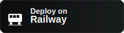

<!--
Bilingual README: Hebrew (RTL) and English
Repository: https://github.com/Artisa111/databot-analytics
-->

<p align="center">
  
  
  <a href="https://github.com/Artisa111/databot-analytics/stargazers" target="_blank"></a>
  
</p>

<p align="center">
  <a href="https://databot-analytics-1.streamlit.app/#data-bot-analytics-pro" target="_blank" style="text-decoration:none;">
    
  </a>
  <a href="https://t.me/maydatabot123_bot" target="_blank" style="text-decoration:none;">
    
  </a>
  <a href="https://railway.app/new/template?template=https%3A%2F%2Fgithub.com%2FArtisa111%2Fdatabot-analytics" target="_blank" style="text-decoration:none;">
    
  </a>
  <a href="https://www.linkedin.com/sharing/share-offsite/?url=https%3A%2F%2Fgithub.com%2FArtisa111%2Fdatabot-analytics" target="_blank" style="text-decoration:none;">
    
  </a>
</p>

<p align="center">
  <a href="#hebrew">עברית</a> • <a href="#english">English</a>
</p>

---

<div id="hebrew" dir="rtl" lang="he" align="right">

<h1>🧠📊 דאטאבוט אנליטיקס — אפליקציית Streamlit ובוט טלגרם לניתוח נתונים</h1>

ברוכים הבאים ל־DataBot Analytics — שילוב חכם בין אפליקציית Streamlit ידידותית למשתמש לבין בוט טלגרם שמאפשר לכם לחקור, לנתח ולהמחיש נתונים במהירות, מכל מקום.

<p>
  <a href="https://databot-analytics-1.streamlit.app/#data-bot-analytics-pro" target="_blank" style="display:inline-block;padding:10px 16px;background:#FF4B4B;color:#fff;border-radius:8px;margin:4px;text-decoration:none;font-weight:600">🚀 פתיחת האפליקציה</a>
  <a href="https://t.me/maydatabot123_bot" target="_blank" style="display:inline-block;padding:10px 16px;background:#26A5E4;color:#fff;border-radius:8px;margin:4px;text-decoration:none;font-weight:600">🤖 פתיחת הבוט</a>
  <a href="#%D7%A4%D7%A8%D7%99%D7%A1%D7%94-%D7%9C-railway" style="display:inline-block;padding:10px 16px;background:#0B0D0E;color:#fff;border-radius:8px;margin:4px;text-decoration:none;font-weight:600">🔧 פריסה ל‑Railway</a>
</p>

<h2>✨ תקציר</h2>
- אפליקציה להצגת וניתוח נתונים (Streamlit) + בוט טלגרם ידידותי.  
- העלאת קבצים, חקירה אינטראקטיבית, תרשימים דינמיים ותובנות.  
- פקודות בוט מהירות: העלאת נתונים, סטטיסטיקה, גרפים ושיתוף.  

<h2>🎯 תכונות האפליקציה (App)</h2>
- העלאת קבצים: CSV / Excel / JSON.
- חקירה מהירה: סינון, מיון, חיתוכים, חיפוש.
- תרשימים אינטראקטיביים: קווי, עמודות, פאי, מפוזר, היסטוגרמה.
- סטטיסטיקה תיאורית: ממוצע, חציון, סטיית תקן, קורלציות.
- ניתוח סדרות זמן: אגרגציות לפי תאריך/שעה.
- ייצוא: הורדת גרפים/טבלאות כתמונה או CSV.
- ממשק ידידותי למובייל ודסקטופ.
- אפשרות לשילוב עוזר חכם (DataBot) לשאלות ותשובות על הנתונים.

<h2>🤖 פקודות/יכולות הבוט (Telegram)</h2>
- /start — התחלה מהירה והנחיות שימוש.  
- /help — רשימת פקודות והסברים.  
- /upload — שליחת קובץ נתונים (CSV/Excel/JSON).  
- /stats — תקציר סטטיסטי מהיר של הקובץ.  
- /plot — יצירת גרפים (בחרו עמודות וסוג תרשים).  
- /sample — דוגמת שורות מהנתונים.  
- /export — קבלת תרשים/טבלה כקובץ להורדה.  
- /settings — הגדרות שפה/פורמט/ברירת מחדל.  
- /about — מידע על DataBot Analytics.  

<sub>הערה: התאימו את הרשימה לפקודות הזמינות בבוט שלכם בפועל.</sub>

<h2>🖼️ גלריה / תצוגה מקדימה</h2>

<!-- תמונות: שנו את הנתיבים אם שמתם קבצים בתיקייה אחרת -->
<p align="center">
  <a href="https://databot-analytics-1.streamlit.app/#data-bot-analytics-pro" target="_blank">
    
  </a><br>
  <sub>מסך בית אינטואיטיבי עם ניווט מהיר וטעינת דוגמאות נתונים</sub>
</p>

<p align="center">
  <a href="https://t.me/maydatabot123_bot" target="_blank">
    
  </a>
  &nbsp;&nbsp;
  <a href="https://t.me/maydatabot123_bot" target="_blank">
    
  </a>
  <br>
  <sub>בוט טלגרם: עזרה, פקודות וגרפים אוטומטיים</sub>
</p>

<h2>🛠 התקנה והרצה מקומית</h2>

1. שכפול הריפו:
   
   <pre><code>git clone https://github.com/Artisa111/databot-analytics.git
cd databot-analytics
</code></pre>

2. יצירת סביבת פייתון והתקנת חבילות:
   
   <pre><code>python -m venv .venv
source .venv/bin/activate  # ב-Windows: .venv\Scripts\activate
pip install -r requirements.txt
</code></pre>

3. משתני סביבה (דוגמה):
   
   <pre><code>export TELEGRAM_BOT_TOKEN=&lt;הטוקן_שלכם&gt;
export PORT=8501
</code></pre>

4. הרצת האפליקציה (התאימו את שם הקובץ הראשי):
   
   <pre><code>streamlit run app.py --server.port 8501 --server.address 0.0.0.0
</code></pre>

5. הרצת הבוט:
   
   <pre><code>python bot.py
</code></pre>

<h2 id="פריסה-ל-railway">☁️ פריסה ל‑Railway</h2>

<p align="center">
  <!-- כפתור תדמיתי (לא חובה) -->
  <a href="https://railway.app/new/template?template=https%3A%2F%2Fgithub.com%2FArtisa111%2Fdatabot-analytics" target="_blank">
    
  </a>
</p>

<p>
- התחברו ל־Railway והקימו פרויקט חדש מהריפו.  <br>
- הגדירו Services נפרדים או תהליך מרובה: <br>
&nbsp;&nbsp;• Web (Streamlit) — פקודת Start: <code>streamlit run app.py --server.port $PORT --server.address 0.0.0.0</code><br>
&nbsp;&nbsp;• Worker (Bot) — פקודת Start: <code>python bot.py</code><br>
- משתני סביבה: <code>TELEGRAM_BOT_TOKEN</code>, <code>PORT</code>, ועוד לפי הצורך. <br>
- עקבו אחרי הלוגים (Logs) עד שהשירותים פעילים.


<h2>🤝 תרומה (Contributing)</h2>
- מזמינים Pull Requests ושיפורים.  
- פתחו Issue להצעות/באגים.  
- שמרו על קוד נקי ותיעוד קצר ב־PR.

<h2>📬 יצירת קשר</h2>
- טלגרם: <a href="https://t.me/maydatabot123_bot" target="_blank">@maydatabot123_bot</a>  
- Issues: <a href="https://github.com/Artisa111/databot-analytics/issues" target="_blank">github.com/Artisa111/databot-analytics/issues</a>  

<h2>📣 שתפו בלינקדאין</h2>

<p>
  <a href="https://www.linkedin.com/sharing/share-offsite/?url=https%3A%2F%2Fgithub.com%2FArtisa111%2Fdatabot-analytics" target="_blank" style="display:inline-block;padding:10px 16px;background:#0A66C2;color:#fff;border-radius:8px;margin:4px;text-decoration:none;font-weight:600">🔗 שתפו בלינקדאין</a>
</p>

<h2>⭐ תמיכה</h2>
אם אהבתם את הפרויקט — תנו כוכב ⭐ לריפו והוסיפו מעקב כדי להתעדכן!

</div>

---

<div id="english" dir="ltr" lang="en">

# 🧠📊 DataBot Analytics — Streamlit App & Telegram Bot for Data Analysis

Welcome to DataBot Analytics — a friendly Streamlit web app paired with a Telegram bot so you can explore, analyze, and visualize data quickly from anywhere.

<p>
  <a href="https://databot-analytics-1.streamlit.app/#data-bot-analytics-pro" target="_blank" style="display:inline-block;padding:10px 16px;background:#FF4B4B;color:#fff;border-radius:8px;margin:4px;text-decoration:none;font-weight:600">🚀 Open the App</a>
  <a href="https://t.me/maydatabot123_bot" target="_blank" style="display:inline-block;padding:10px 16px;background:#26A5E4;color:#fff;border-radius:8px;margin:4px;text-decoration:none;font-weight:600">🤖 Open the Telegram Bot</a>
  <a href="#deploy-to-railway" style="display:inline-block;padding:10px 16px;background:#0B0D0E;color:#fff;border-radius:8px;margin:4px;text-decoration:none;font-weight:600">🔧 Deploy to Railway</a>
</p>

## ✨ Overview
- Streamlit app for data viewing and analysis + a friendly Telegram bot.  
- Upload files, explore interactively, build charts, and extract insights.  
- Fast bot commands for upload, stats, plots, and sharing.  

## 🎯 App Features
- File upload: CSV / Excel / JSON.
- Fast exploration: filter, sort, slice, search.
- Interactive charts: line, bar, pie, scatter, histogram.
- Descriptive stats: mean, median, std, correlations.
- Time-series analysis: date/time groupings and aggregations.
- Export: download charts/tables as images or CSV.
- Mobile and desktop friendly.
- Optional smart assistant (DataBot) for data Q&A.

## 🤖 Bot Commands/Capabilities
- /start — quick onboarding and usage guide.  
- /help — list of commands and explanations.  
- /upload — send a data file (CSV/Excel/JSON).  
- /stats — quick statistical summary of your file.  
- /plot — generate charts (choose columns and chart type).  
- /sample — show a sample of rows from your data.  
- /export — receive chart/table as a downloadable file.  
- /settings — language/format/defaults.  
- /about — info about DataBot Analytics.  

<sub>Note: adjust the list to match your bot’s actual commands.</sub>

## 🖼️ Gallery / Preview

<!-- Images: change paths if you store files in a different folder -->
<p align="center">
  <a href="https://databot-analytics-1.streamlit.app/#data-bot-analytics-pro" target="_blank">
    
  </a><br>
  <sub>Clean home screen with quick navigation and demo data loaders</sub>
</p>

<p align="center">
  <a href="https://t.me/maydatabot123_bot" target="_blank">
    
  </a>
  &nbsp;&nbsp;
  <a href="https://t.me/maydatabot123_bot" target="_blank">
    
  </a>
  <br>
  <sub>Telegram bot: help, commands, and automatic visualizations</sub>
</p>

## 🛠 Install & Run Locally

1) Clone:

```
git clone https://github.com/Artisa111/databot-analytics.git
cd databot-analytics
```

2) Create venv and install deps:

```
python -m venv .venv
source .venv/bin/activate  # on Windows: .venv\Scripts\activate
pip install -r requirements.txt
```

3) Environment variables (example):

```
export TELEGRAM_BOT_TOKEN=<your_token_here>
export PORT=8501
```

4) Run the app (adjust entry file name as needed):

```
streamlit run app.py --server.port 8501 --server.address 0.0.0.0
```

5) Run the bot:

```
python bot.py
```

## ☁️ Deploy to Railway

<p align="center">
  <!-- Optional visual button -->
  <a href="https://railway.app/new/template?template=https%3A%2F%2Fgithub.com%2FArtisa111%2Fdatabot-analytics" target="_blank">
    
  </a>
</p>

- Sign in to Railway and create a new project from this repo.  
- Configure two services (Web + Worker) or a multi‑process setup:  
  • Web (Streamlit) start: `streamlit run app.py --server.port $PORT --server.address 0.0.0.0`  
  • Worker (Bot) start: `python bot.py`  
- Set environment variables: `TELEGRAM_BOT_TOKEN`, `PORT`, and any others you need.  
- Deploy and monitor logs until both services are healthy.


## 🤝 Contributing
- Pull Requests are welcome!  
- Open an Issue for feature requests/bug reports.  
- Keep code clean and include concise PR descriptions.

## 📬 Contact
- Telegram: <a href="https://t.me/maydatabot123_bot" target="_blank">@maydatabot123_bot</a>  
- Issues: <a href="https://github.com/Artisa111/databot-analytics/issues" target="_blank">github.com/Artisa111/databot-analytics/issues</a>

## 📣 Share on LinkedIn

<p>
  <a href="https://www.linkedin.com/sharing/share-offsite/?url=https%3A%2F%2Fgithub.com%2FArtisa111%2Fdatabot-analytics" target="_blank" style="display:inline-block;padding:10px 16px;background:#0A66C2;color:#fff;border-radius:8px;margin:4px;text-decoration:none;font-weight:600">🔗 Share this repo on LinkedIn</a>
</p>

## ⭐ Support
If you like this project, please star ⭐ the repo and follow for updates!

</div>